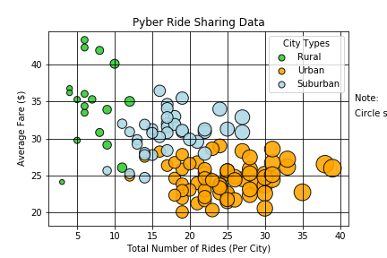
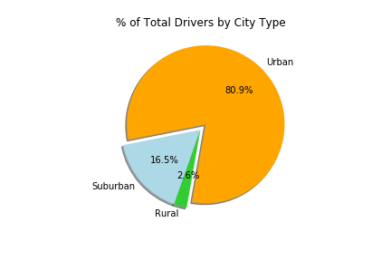
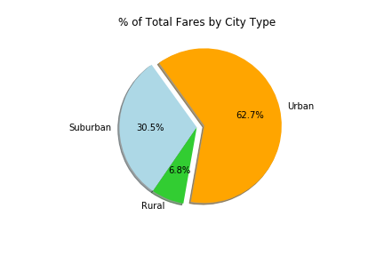
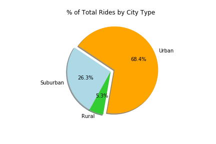

### Pyber
The objective was to build a Bubble Plot that showcases the relationship between four key variables:

- Average Fare ($) Per City
- Total Number of Rides Per City
- Total Number of Drivers Per City
- City Type (Urban, Suburban, Rural)

In addition, produce the following three pie charts:

- % of Total Fares by City Type
- % of Total Rides by City Type
- % of Total Drivers by City Type

### Scatter Plot 

### Total Drivers

### Total Fares

### Total Rides

